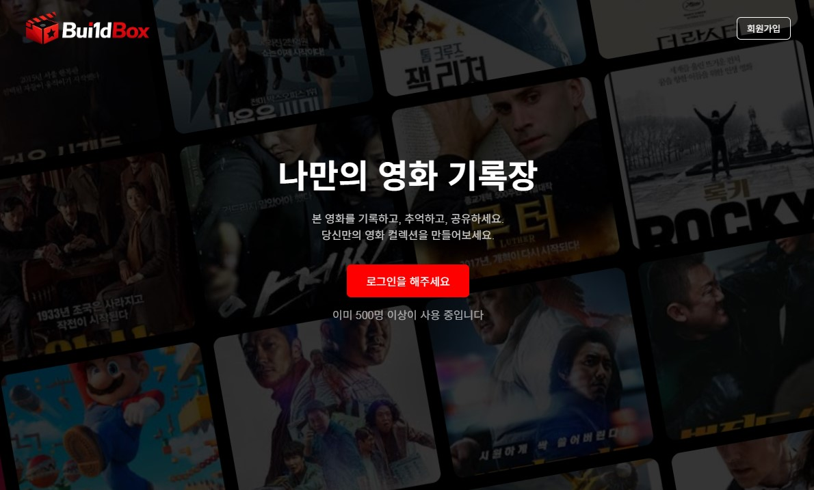
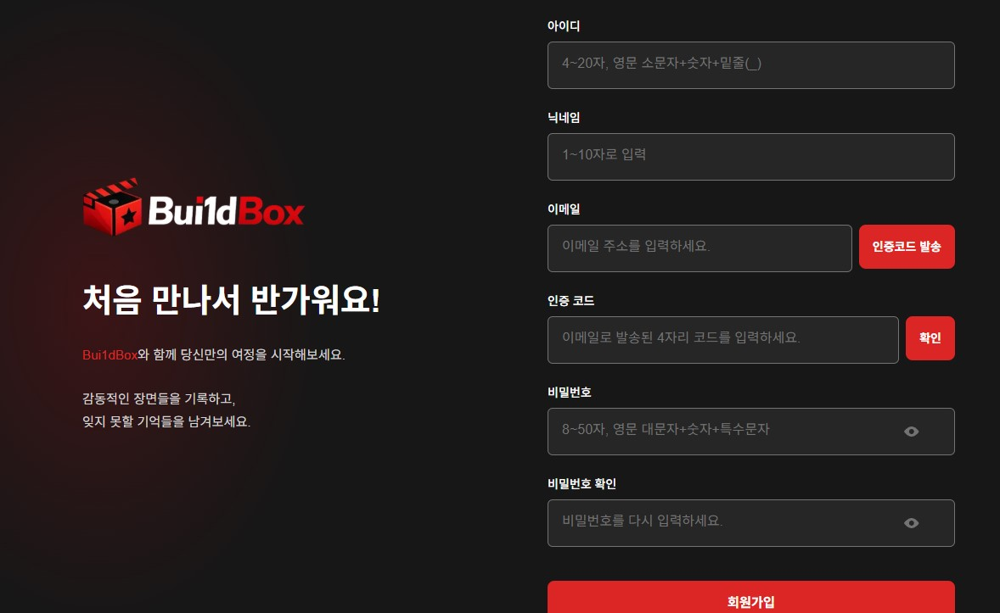
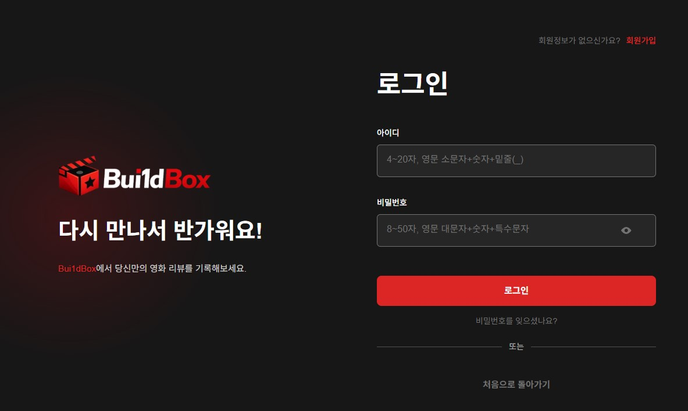
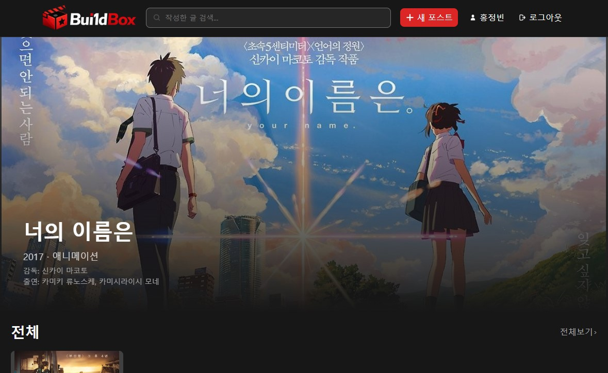
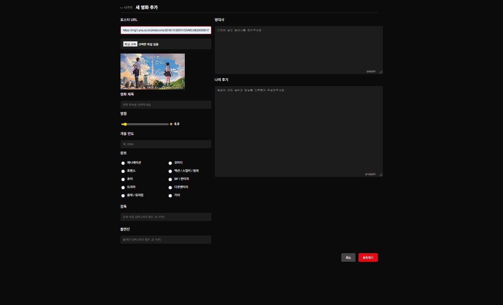
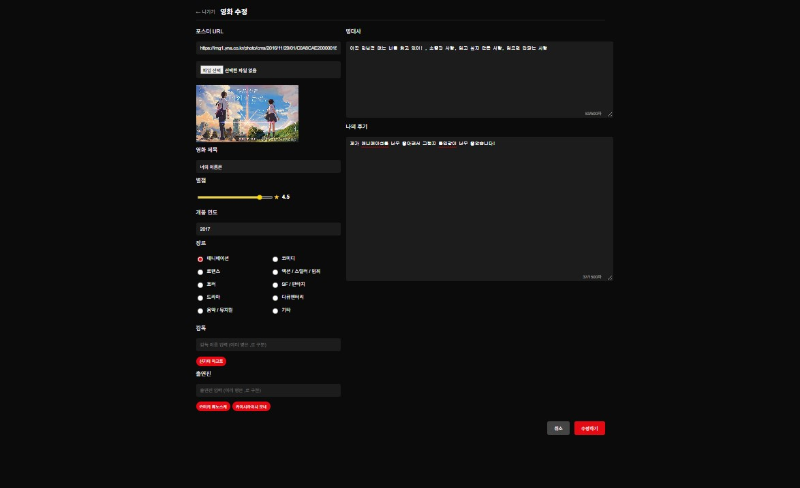
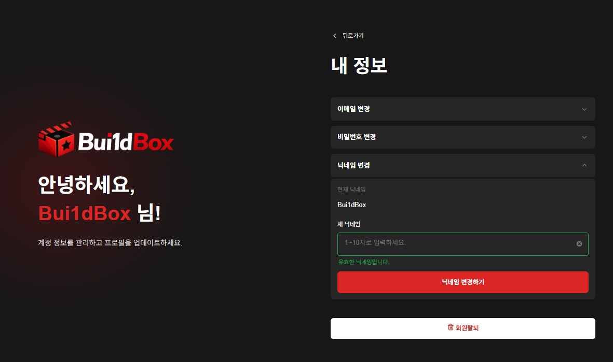

# Bui1d-UP

### 바닐라 프로젝트를 Bui1d UP합니다.

<h1 align="center">
  Bui1d<span style="color:red;">Box</span>
</h1>

<p align="center">
  
</p>

> 🎬 <b style="font-size:18px;">Bui1d<span style="color:red;">Box</span></b>는 영화를 보고 감상평을 남길 수 있는 웹 서비스입니다.

## 📅 프로젝트 캘린더

| 일  | 월                    | 화                    | 수                        | 목                    | 금                     | 토                    |
| --- | --------------------- | --------------------- | ------------------------- | --------------------- | ---------------------- | --------------------- |
|     |                       |                       |                           |                       | 🔥 3/26<br/>프로토타입 | 🔥 3/27<br/>주제 선정 |
|     | 🔥 3/30<br/>특강      | 🔥 3/31<br/>휴강      | 🔥 4/1<br/>마일스톤       | 🔥 4/2<br/>HTML & CSS | 🔥 4/3<br/>HTML & CSS  |                       |
|     | 🔥 4/6<br/>HTML & CSS | 🔥 4/7<br/>HTML & CSS | 🔥 4/8<br/>중간점검       | 🔥 4/9<br/>JS 개발    | 🔥 4/10<br/>휴강       |                       |
|     | 🔥 4/13<br/>JS 개발   | 🔥 4/14<br/>JS 개발   | 🔥 4/15<br/>프로젝트 마감 | 🔥 4/16<br/>PPT 제작  | 🔥 4/17<br/>휴강       |                       |
|     | 🔴 4/20<br/>최종 발표 |                       |                           |                       |                        |                       |

---

## 🎯 프로젝트 목표 / 기획 의도

- 사용자들이 영화 리뷰를 쉽게 작성하고 공유할 수 있도록 한다.
- 직관적인 UI/UX로 누구나 쉽게 사용할 수 있게 한다.
- 개인 맞춤형 영화 기록 공간 제공

---

## 🛠 사용 기술 스택

### 💻 Frontend

<p>
  
  
  
</p>

### ⚙️ 기타

<p>
  
  
</p>

### ⚙️ 기타

- Git / GitHub

---

## 👥 팀원 및 역할

<table border="1" cellspacing="0" cellpadding="20">
  <tr>
    <td align="center" width="250">
      <br/><br/>
      <b>👑 강재훈 (조장)</b><br/>
      <sub>Frontend</sub><br/><br/>
      메인 / 상세 / 장르 페이지
    </td>
    <td align="center" width="250">
      <br/><br/>
      <b>🟣 최영은 (팀원)</b><br/>
      <sub>Frontend</sub><br/><br/>
      마이페이지 / 로그인 / 회원가입
    </td>
    <td align="center" width="250">
      <br/><br/>
      <b>🟡 홍정빈 (팀원)</b><br/>
      <sub>Frontend</sub><br/><br/>
      랜딩 / 업로드 / 수정
    </td>
  </tr>
</table>

## 🎬 시연 이미지

### 📌 랜딩 페이지 (landing)



### 📌 회원가입 페이지 (signup)



### 📌 로그인 페이지 (login)



### 📌 메인 페이지 (main)



### 📌 업로드 페이지 (upload)



### 📌 수정 페이지 (edit)



### 📌 마이 페이지 (mypage)

## 

## 🎬 영상

---

## 📂 폴더 구조

```bash
📦 Build-UP
 ┣ 📂 public
 ┃ ┗ 📜 build-box.jpg
 ┣ 📂 src
 ┃ ┣ 📂 API
 ┃ ┣ 📂 assets
 ┃ ┣ 📂 components
 ┃ ┣ 📂 landing
 ┃ ┃ ┣ 📜 landing.html
 ┃ ┃ ┣ 📜 landing.css
 ┃ ┃ ┗ 📜 landing.js
 ┃ ┣ 📂 main
 ┃ ┃ ┣ 📂 detail
 ┃ ┃ ┣ 📂 header
 ┃ ┃ ┣ 📂 main_list
 ┃ ┃ ┗ 📂 genre_more
 ┃ ┣ 📂 mypage
 ┃ ┃ ┣ 📜 mypage.html
 ┃ ┃ ┗ 📜 mypage.js
 ┃ ┣ 📂 paragraph
 ┃ ┃ ┣ 📂 upload
 ┃ ┃ ┗ 📂 edit
 ┃ ┣ 📂 styles
 ┃ ┗ 📂 utils
 ┣ 📜 README.md
 ┗ 📜 .env
```

## ⚠️ 문제점 및 해결 과정

---

### 👑 강재훈 (조장)

### ❗ 1. 메인 페이지 및 리스트 렌더링 문제

- **문제 상황**  
  메인 페이지에서 영화 리스트가 정상적으로 렌더링되지 않거나, 데이터 순서 및 UI 정렬이 깨지는 문제가 발생

- **원인**  
  API 데이터 구조와 프론트 데이터 구조가 일치하지 않았고, DOM 업데이트가 비효율적으로 이루어짐

- **해결**  
  데이터 구조를 통일하고 `map()` 기반 렌더링으로 개선하여 UI 일관성과 성능 향상

---

### ❗ 2. 검색 기능 데이터 필터링 문제

- **문제 상황**  
  검색 결과가 정확하지 않거나 일부 키워드가 동작하지 않음

- **원인**  
  단순 문자열 비교로 인해 대소문자 및 부분 검색 미지원

- **해결**  
  문자열을 소문자로 변환하고 `includes()`를 활용해 부분 검색 기능 구현

---

### ❗ 3. 장르 키값 불일치 문제

- **문제 상황**  
  동일한 장르임에도 페이지마다 다르게 표시됨

- **원인**  
  장르명을 문자열로 직접 사용하면서 표기 불일치 발생

- **해결**  
  장르 키값을 상수로 관리하여 데이터 일관성 확보

---

### ❗ 4. 상세 페이지 데이터 전달 문제

- **문제 상황**  
  상세 페이지에서 선택한 데이터가 정상적으로 표시되지 않음

- **원인**  
  페이지 간 데이터 전달 방식이 명확하지 않음

- **해결**  
  URL 파라미터 또는 `localStorage`를 활용하여 데이터 전달 구조 개선

---

### ❗ 5. UI 디자인 일관성 문제

- **문제 상황**  
  페이지마다 UI 스타일이 달라 사용자 경험이 일관되지 않음

- **원인**  
  공통 스타일 없이 각 페이지별로 CSS가 분산됨

- **해결**  
  공통 스타일을 `styles` 폴더로 분리하고 재사용 구조로 리팩토링

---

### 🟣 최영은 (팀원) (인증 / 로그인)

### ❗ 1. 인증 코드 발송 문제

- **문제 상황**  
  이메일이 발송되지 않지만 콘솔 코드로 인증이 진행됨

- **원인**  
  이메일 발송(SMTP)이 구현되지 않은 상태

- **해결**  
  인증 로직과 발송 기능을 분리하고 구조 개선

---

### ❗ 2. 로그인 및 비밀번호 처리 문제

- **문제 상황**  
  로그인 검증 및 에러 처리가 불명확

- **원인**  
  API 응답에 대한 예외 처리 부족

- **해결**  
  조건 분기 강화 및 사용자 에러 메시지 개선

---

### ❗ 3. 인증 상태 유지 문제

- **문제 상황**  
  페이지 이동 시 로그인 상태가 유지되지 않음

- **원인**  
  상태 저장 방식이 일관되지 않음

- **해결**  
  `localStorage` 기반으로 인증 상태 유지 구현

---

### 🟡 홍정빈 (팀원) (업로드 / 수정 / URL이미지)

### ❗ 1. 이미지 업로드 문제

- **문제 상황**  
  파일, URL, 드래그 방식 모두 이미지 미리보기 불가

- **원인**  
  파일 처리 로직과 미리보기 렌더링이 분리됨

- **해결**  
  `FileReader`를 활용하여 통합 처리 및 미리보기 구현

---

### ❗ 2. upload / edit 페이지 불일치 문제

- **문제 상황**  
  두 페이지의 UI 및 동작 방식이 다름

- **원인**  
  코드 구조 및 이벤트 처리 방식 차이

- **해결**  
  upload 기준으로 edit 페이지 리팩토링하여 구조 통일

---

### ❗ 3. 파일 업로드와 URL 입력 방식 충돌 문제

- **문제 상황**  
  파일 업로드와 URL 입력을 동시에 사용할 경우 어떤 값이 우선 적용되는지 불명확

- **원인**  
  두 입력 방식에 대한 상태 관리가 분리되어 충돌 발생

- **해결**  
  파일 업로드와 URL 입력 중 하나만 선택하도록 UX를 개선하고,  
  선택된 방식만 처리하도록 로직을 명확하게 분기 처리

### ❗ 4. 영화 후기 입력 검증 문제

- **문제 상황**  
  영화 후기 작성 시 필수 입력값이 비어있거나 잘못된 값이 입력되어도 정상적으로 등록되는 문제가 발생

- **원인**  
  입력값 검증 로직이 일부 필드에만 적용되어 있었고,  
  upload와 edit 페이지 간 검증 방식이 서로 달라 일관성이 없었음

- **해결**  
  모든 입력 필드에 대해 공통 검증 로직을 적용하고,  
  조건문을 통해 필수값 누락 시 제출이 되지 않도록 처리

---

### ❗ 5. 사용자 입력 예외 처리 부족 문제

- **문제 상황**  
  잘못된 형식의 데이터(빈 문자열, 공백 등)가 입력되어도 저장되는 문제 발생

- **원인**  
  입력값에 대한 세부적인 유효성 검사(trim, 길이 체크 등)가 부족했음

- **해결**  
  `trim()`을 활용하여 공백 제거 후 검증을 수행하고,  
  최소 길이 및 형식 조건을 추가하여 데이터 유효성 강화

## 🔗 블로그

https://velog.io/@example
