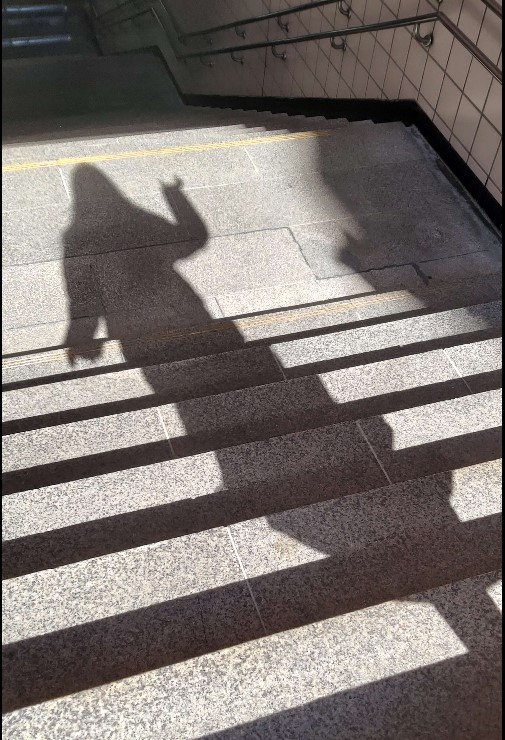
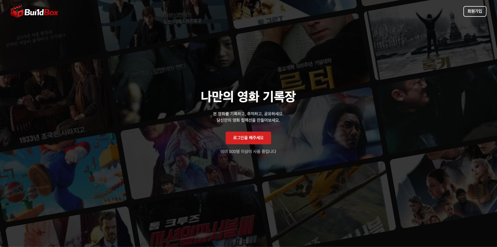
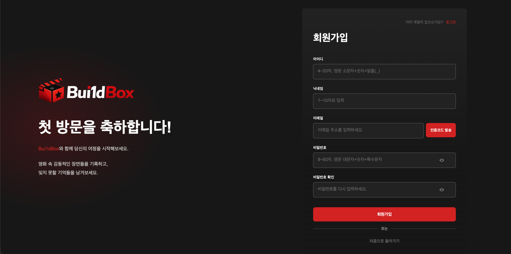
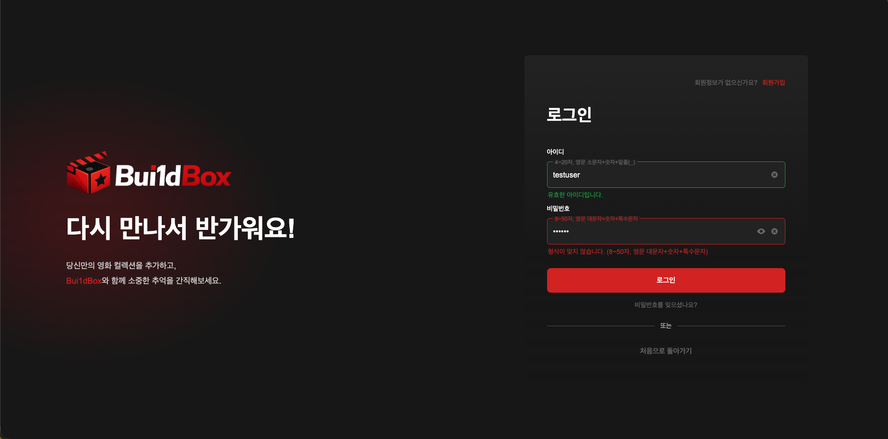
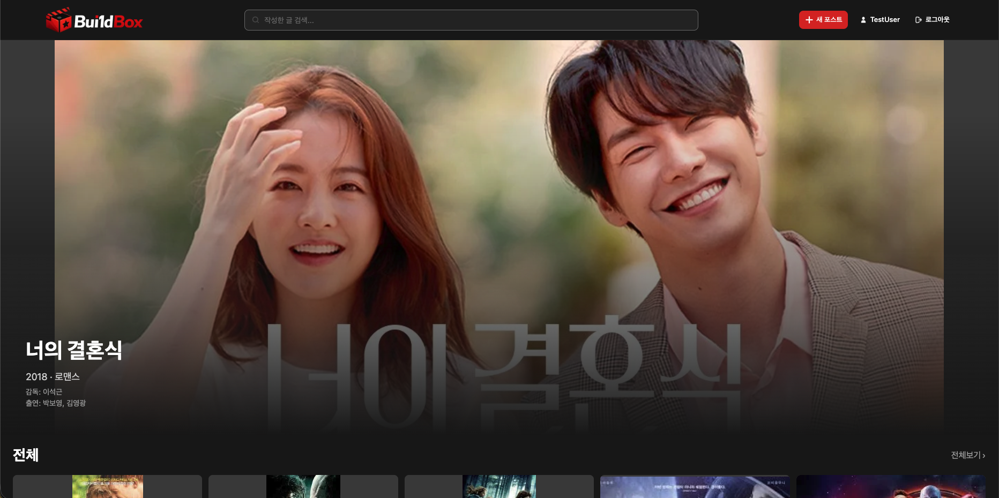
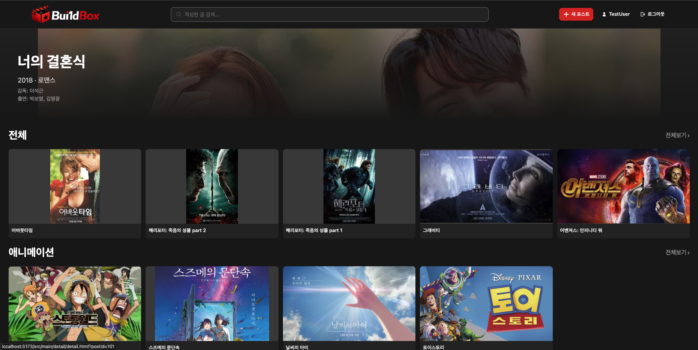
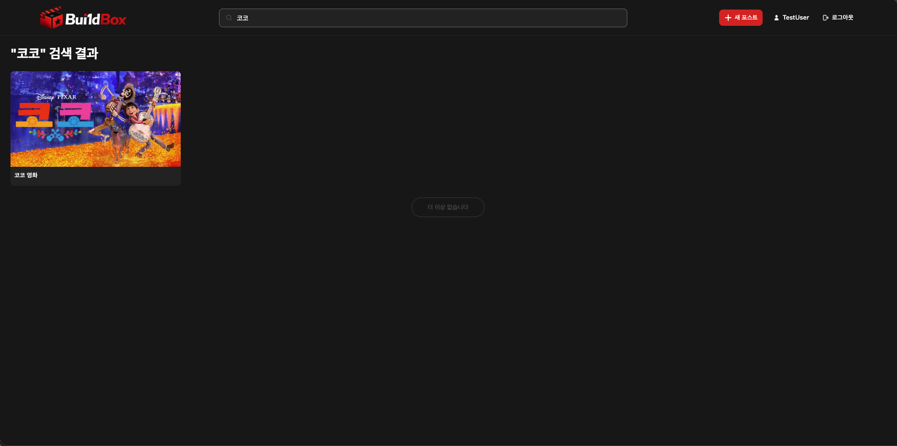
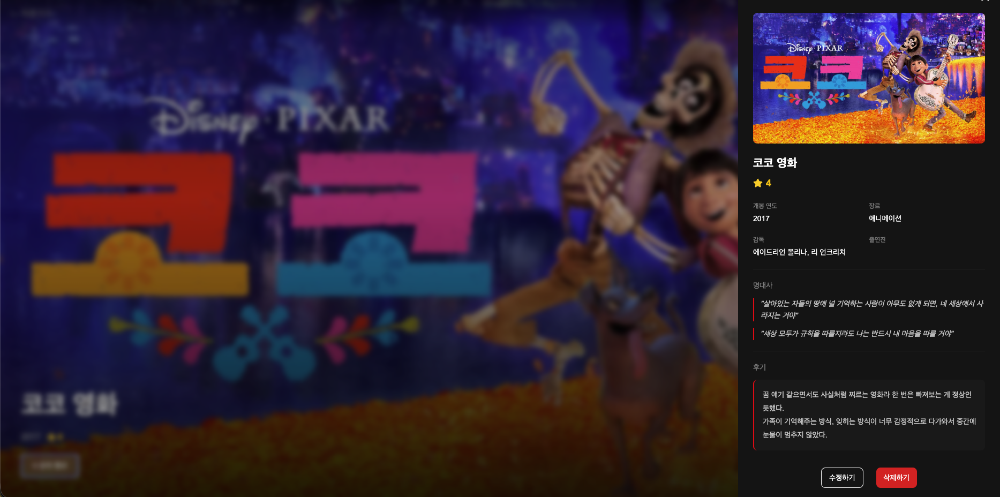
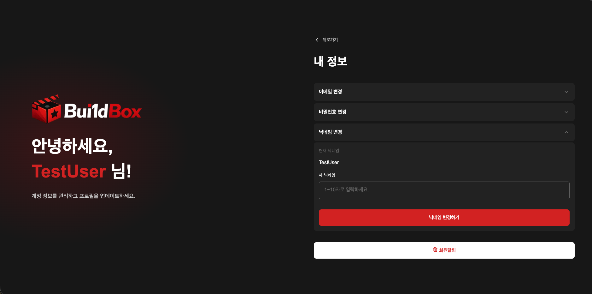

# Bui1d-UP

### 바닐라 프로젝트를 Bui1d UP합니다.

<h1 align="center">
  Bui1d<span style="color:red;">Box</span>
</h1>

<p align="center">
  
</p>

> 🎬 <b style="font-size:18px;">Bui1d<span style="color:red;">Box</span></b>는 영화를 보고 감상평을 남길 수 있는 웹 서비스입니다.

---

## 📅 프로젝트 캘린더

| 일  | 월                     | 화                    | 수                            | 목                    | 금                               | 토  |
| --- | ---------------------- | --------------------- | ----------------------------- | --------------------- | -------------------------------- | --- |
|     |                        |                       |                               | 🔥 3/26<br/>주제 선정 | 🔥 3/27<br/>프로토타입,시안 제작 |     |
|     | 🔥 3/30<br/>HTML & CSS | 🔥 3/31<br/>휴강      | 🔥 4/1<br/>마일스톤           | 🔥 4/2<br/>HTML & CSS | 🔥 4/3<br/>HTML & CSS            |     |
|     | 🔥 4/6<br/>HTML & CSS  | 🔥 4/7<br/>HTML & CSS | 🔥 4/8<br/>중간점검 및 테스트 | 🔥 4/9<br/>JS 개발    | 🔥 4/10<br/>휴강                 |     |
|     | 🔥 4/13<br/>JS 개발    | 🔥 4/14<br/>JS 개발   | 🔥 4/15<br/>프로젝트 마감     | 🔥 4/16<br/>PPT 제작  | 🔥 4/17<br/>휴강                 |     |
|     | 🔴 4/20<br/>최종 발표  |                       |                               |                       |                                  |     |

---

## 🎯 프로젝트 목표 / 기획 의도

> 영화를 감상하고, 자신만의 리뷰를 기록할 수 있는 웹 서비스

1. 개인 맞춤형 영화 기록 공간 제공
2. 간편한 리뷰 작성으로 영화의 감동을 간직하도록 함
3. 직관적인 UI/UX로 누구나 쉽게 사용할 수 있도록 한다

---

## 🛠 사용 기술 스택

### 💻 Frontend

<p>
  
  
  
  
</p>

### ⚙️ 기타

<p>
  
  
  
  
</p>

---

## 👥 팀원 및 역할

<table border="1" cellspacing="0" cellpadding="20">
  <tr>
    <td align="center" width="250" height="300">
      <br/><br/>
      <b>👑 강재훈 (조장)</b><br/>
      <sub>Frontend</sub><br/><br/>
      메인 / 상세 / 장르 페이지<br/>
    </td>
    <td align="center" width="250" height="300">
  <br/><br/>
  <b>🟣 (팀원)</b><br/>
  <sub>Frontend</sub><br/><br/>
  마이페이지 / 로그인 /  회원가입<br/>
  
</td>
    <td align="center" width="250" height="300">
      <br/><br/>
      <b>🟡 홍정빈 (팀원)</b><br/>
      <sub>Frontend</sub><br/><br/>
      랜딩 / 업로드 / 수정<br/>
    </td>
  </tr>
</table>

---

## 🎬 시연 이미지

### 📌 랜딩 페이지 (landing)



### 📌 회원가입 페이지 (signup)



### 📌 로그인 페이지 (login)



### 📌 메인 페이지 (main)





### 📌 검색 페이지 (search)



### 📌 상세 페이지 (detail)



### 📌 업로드 페이지 (upload)


### 📌 수정 페이지 (edit)


### 📌 마이 페이지 (mypage)



---

## 🎬 시연 영상

[](https://youtu.be/PAx8uO0EVZg)

> 👆 이미지를 클릭하면 시연 영상으로 이동합니다.

---

## 📂 폴더 구조

```bash
📦 Build-UP
 ┣ 📂 public
 ┃ ┗ 📜 build-box.jpg
 ┣ 📂 src
 ┃ ┣ 📂 API
 ┃ ┣ 📂 assets
 ┃ ┣ 📂 components
 ┃ ┣ 📂 landing
 ┃ ┃ ┣ 📜 landing.html
 ┃ ┃ ┣ 📜 landing.css
 ┃ ┃ ┗ 📜 landing.js
 ┃ ┣ 📂 main
 ┃ ┃ ┣ 📂 detail
 ┃ ┃ ┣ 📂 header
 ┃ ┃ ┣ 📂 main_list
 ┃ ┃ ┗ 📂 genre_more
 ┃ ┣ 📂 mypage
 ┃ ┃ ┣ 📜 mypage.html
 ┃ ┃ ┗ 📜 mypage.js
 ┃ ┣ 📂 paragraph
 ┃ ┃ ┣ 📂 upload
 ┃ ┃ ┗ 📂 edit
 ┃ ┣ 📂 styles
 ┃ ┗ 📂 utils
 ┣ 📜 README.md
 ┗ 📜 .env
```

---

## ⚠️ 발생한 문제들과 해결과정

### ❗ 1. 파일 업로드와 URL 입력 방식 충돌 문제

- **문제 상황**: 파일 업로드와 URL 입력을 동시에 사용할 경우 어떤 값이 우선 적용되는지 불명확
- **원인**: 두 입력 방식에 대한 상태 관리가 분리되어 충돌 발생
- **해결**: 파일 업로드와 URL 입력 중 하나만 선택하도록 UX를 개선하고, 선택된 방식만 처리하도록 로직을 명확하게 분기 처리

---

### ❗ 2. 인증 상태 유지 문제

- **문제 상황**: 로그인에서 세션 방식과 토큰에 대한 고민
- **해결**: 계속 연결되어 있을 필요가 없어 서버에 부하가 적은 토큰 방식으로 결정함

---

### ❗ 3. 장르 키값 불일치 문제

- **문제 상황**: 동일한 장르임에도 페이지마다 다르게 표시되고 키값이 달랐음
- **원인**: 장르 키값을 페이지별로 직접 입력하다 보니 오타 발생
- **해결**: 장르 키값을 하나의 파일에 상수로 관리하여 데이터 일관성 확보

---

### ❗ 4. UI 스타일 일관성 문제

- **문제 상황**: 페이지마다 UI 스타일이 달라 사용자 경험이 일관되지 않음
- **원인**: 공통 스타일 없이 각 페이지별로 CSS가 분산됨
- **해결**: 공통 스타일을 `styles` 폴더를 만들어 분리하고 component 형태로 리팩토링함

---

### ❗ 5. 입력값 검증 및 예외 처리 문제

- **문제 상황**: 필수 입력값이 비어있거나 잘못된 형식, 공백이 있음에도 데이터가 그냥 입력되어 버리는 문제가 있었음
- **원인**: 검증 로직이 일부 필드에만 적용됐고, upload·edit 페이지는 차이가 거의 없었지만 검증 방식이 달랐으며 세부 유효성 검사(trim, 길이 체크 등)가 부족했음
- **해결**: 대부분의 필드에 정규식 통일, 검증 로직을 강화하였고 `trim()`을 통해 잘못 입력된 공백을 제거함, 최소 길이 조건을 추가하여 데이터 유효성 강화, 입력값들을 배열로 만들어 상태 관리를 편리하도록 개선

---

### ❗ 6. 메인 배너 UI 문제

- **문제 상황**: 배너 영역이 단순 이미지로 고정되어 스크롤 가능 여부가 명확하지 않았음
- **해결**: 배너를 배경으로 처리하고, 스크롤이 가능하다는 것을 인지할 수 있는 UI로 개선

---

### ❗ 7. UI 일관성 및 접근성 문제

- **문제 상황**: 페이지마다 로고·폰트가 달랐고, floating label 초기 구현 시 label이 input 내부에 배치되어 접근성 속성이 부적절하게 적용되었음 (aria-live 오용, 명시적 연결 부족)
- **해결**: 로고·폰트 통합, 입장 애니메이션 추가, `for`와 `id`로 label과 input을 명확하게 연결, hint 문구를 별도 요소로 분리하여 `aria-describedby`로 연결, 상태 메시지는 `role="status"`로 스크린리더에 전달되도록 개선

---

## 🔗 블로그

추후 추가예정

---

## 💬 프로젝트 소감

- 강재훈

이전 프로젝트에서는 마일스톤을 설정하지 않고 작업을 시작해 일정과 작업 흐름이 일관되지 않았고, 전체적으로 관리가 잘 되지 않는 아쉬움이 있었다.
반면 이번 프로젝트에서는 시작 단계부터 디자인과 일정에 대해 구체적인 목표를 수립하고 진행하여 훨씬 체계적으로 작업할 수 있었다. 이에 맞춰 폴더 구조도 정리되어 개발 과정이 더욱 수월했다.
프로젝트를 진행하면서 예상치 못한 문제가 발생하기도 했지만, 팀원들과 유연하게 대응할 수 있었고 빠르게 해결해 나갈 수 있었다. 또한 팀원 모두가 맡은 역할을 책임감 있게 수행하며 협업이 원활하게 이루어졌다.
특히, 장르 키 값이나 UI 문제로 리팩토링을 진행해야 문제가 생겼을 때도 주저하지 않고 바로 회의를 통해 의견을 공유할 수 있었고, 서로 눈치를 보기보다 편안한 분위기 속에서 자유롭게 소통할 수 있었던 점이 우리 팀의 가장 큰 강점이었다고 생각한다.

- 최영은

지난 UI 프로젝트에서 프로젝트 계획 수립과 협업 방식을 경험했던 덕분에, 첫 바닐라 프로젝트임에도 비교적 수월하게 작업에 임할 수 있었다. 특히 commit 규칙과 팀 그라운드 룰을 사전에 정하고, 아이스브레이킹을 통해 팀원 간의 거리감을 줄였던 점이 협업에 큰 도움이 되었다.
이번 프로젝트를 통해 개발 능력뿐만 아니라, 팀원 간의 원활한 소통이 프로젝트의 완성도를 좌우한다는 것을 체감할 수 있었다. 새로운 기술을 도입할 때나 오류를 해결하는 과정에서도, 자유롭게 의견을 제시할 수 있는 분위기가 형성되어 있었기에 문제를 빠르게 해결할 수 있었다.
가령 upload 페이지에서 이미지 미리보기 기능을 구현한 팀원이 시연을 진행하는 과정에서, 미리보기와 실제 이미지 업로드의 상태를 어떻게 분리할 것인지, 특정 방식에서의 메모리 누수를 어떻게 방지할 것인지에 대한 여러 조언을 들을 수 있었다. 해당 기능을 이미 구현해본 경험이 있는 팀원의 설명을 통해 서로 다른 접근 방식에 대한 비교도 가능했고, 이후 강사님의 피드백을 통해 이러한 설계가 왜 중요한지 다시 한 번 짚고 넘어갈 수 있었다.
단순히 결과물을 만드는 것을 넘어, ‘함께 일하는 방식’의 중요성을 깨달았다는 점에서 의미 있는 프로젝트였다.

- 홍정빈

이번 프로젝트를 통해 프론트엔드 개발의 전체 흐름을 경험할 수 있었습니다. 특히 제가 맡았던 landing, upload, edit 부분을 개발하면서 몰랐던 코드들이 어떤 방식으로 사용되는지 이해할 수 있었습니다.

개발 과정에서 이미지 업로드, UI 정렬, 입력값 검증과 같은 다양한 문제들을 직접 해결해보며 문제 해결 능력을 키울 수 있었습니다.
처음에는 사소한 오류에도 시간이 오래 걸렸지만, 점차 원인을 분석하고 해결하는 과정에 익숙해지면서 개발에 대한 이해도가 높아졌습니다.

또한 Git을 활용한 협업 과정에서 브랜치 관리와 충돌 해결을 경험하며 협업의 중요성을 느낄 수 있었습니다. 특히 rebase 과정에서 발생한 충돌을 해결하는 과정에서 팀원들의 도움을 받아 문제를 해결할 수 있었고, 이를 통해 Git의 동작 원리를 더 깊이 이해할 수 있었습니다.

프로젝트를 진행하면서 혼자 해결하기 어려운 부분들도 있었지만, 팀원들과 소통하며 해결해 나가는 과정에서 협업의 중요성을 다시 한 번 느낄 수 있었습니다. 이번 경험을 바탕으로 앞으로는 더 효율적이고 안정적인 코드를 작성하는 개발자가 되기 위해 계속해서 학습해 나가고자 합니다.
